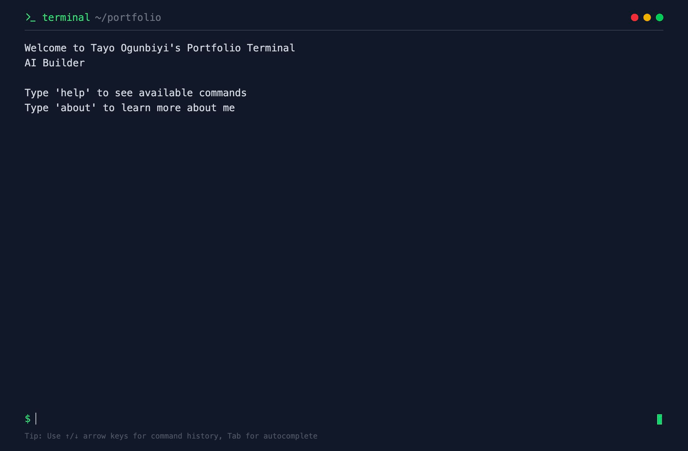

# terminal-portfolio

A terminal-style portfolio website. Type commands to explore.



## Commands

| Command | Description |
|---|---|
| `help` | List available commands |
| `about` | About me |
| `projects` | My projects |
| `skills` | Technical skills |
| `experience` | Work experience |
| `education` | Education |
| `contact` | GitHub & LinkedIn |
| `clear` | Clear the terminal |

↑/↓ arrow keys for command history · Tab for autocomplete

## Dev

```bash
npm install
npm run dev
```

Built with React, TypeScript, Tailwind CSS, Vite.
